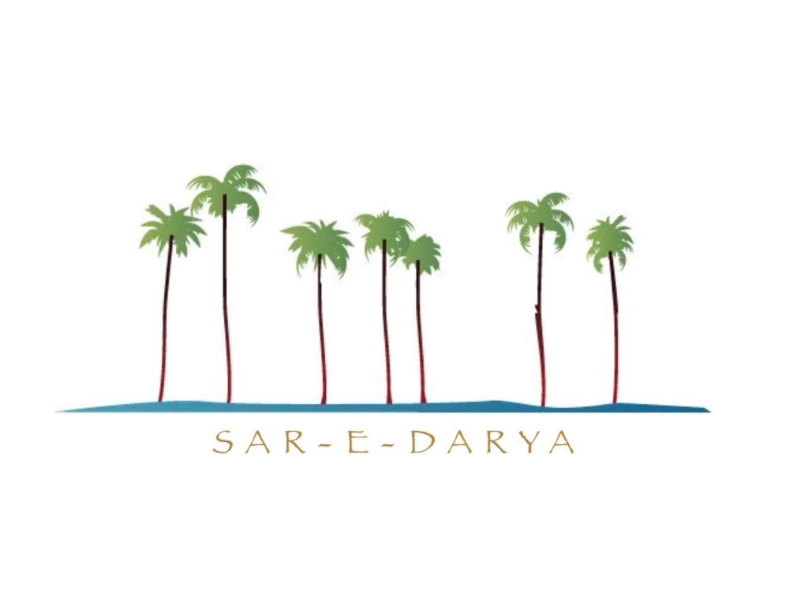

# 🌴 Sar-E-Darya Restaurant Management Dashboard
## (English | اردو | العربية)

---

## 🇺🇸 English Version

Welcome to the **Sar-E-Darya Restaurant Management Dashboard**, a premium, offline-first management solution designed specifically for modern restaurant operations.

### 🌟 Key Features
- **Direct Sales Entry**: Quickly enter lump-sum sales figures.
- **Cash Denominations Counter**: Accurate tracking of physical cash (5000 to 10 PKR).
- **Stock Management**: Track inventory with an option to deduct specific items from profit.
- **Expense Tracking**: Categorized management (Rent, Utility, Ration, etc.).
- **Daily Wages**: Record employee wages, advances, and extra payments.
- **Customizable Waiter Commission**: Adjustable percentage (1-10%) with a profit deduction toggle.
- **Real-time Analytics**: Instant calculation of sales, expenses, and net profit.
- **Premium Excel Export**: Professional, A4-landscape reports using `ExcelJS`.
- **Khajoor (Date Palm) Theme**: A premium aesthetic inspired by the Sar-E-Darya brand.

---

## 🇵🇰 اردو ورژن (Urdu)

**سرِ دریا ریسٹورنٹ مینجمنٹ ڈیش بورڈ** میں خوش آمدید۔ یہ ایک جدید اور پریمیم مینجمنٹ سسٹم ہے جو خاص طور پر ریسٹورنٹ کے روزمرہ کے معاملات کو سنبھالنے کے لیے بنایا گیا ہے۔

### 🌟 نمایاں خصوصیات
- **براہِ راست سیل انٹری**: دن بھر کی کل فروخت کی رقم آسانی سے درج کریں۔
- **کیش کاؤنٹر**: نوٹوں کی تعداد (5000 سے 10 تک) کے حساب سے نقدی کا درست ریکارڈ۔
- **سامان آمد (اسٹاک)**: سامان کی انٹری اور مخصوص اشیاء کو منافع سے کاٹنے کی سہولت۔
- **اخراجات کا ریکارڈ**: کرایہ، بجلی، راشن اور دیگر زمروں میں اخراجات کی تفصیل۔
- **ڈیلی اجرت**: ملازمین کی اجرت، ایڈوانس اور اضافی رقم کا مکمل حساب۔
- **ویٹرز کمیشن**: 1% سے 10% تک کمیشن ایڈجسٹمنٹ اور منافع سے کٹوتی کا آپشن۔
- **فی الوقت حساب کتاب**: کُل فروخت، اخراجات اور خالص منافع کا فوری حساب۔
- **پریمیم ایکسل رپورٹ**: اے فور سائز (لینڈ اسکیپ) میں پروفیشنل رپورٹ ڈاؤن لوڈ کریں۔
- **کھجور تھیم**: سرِ دریا برانڈ سے متاثر ایک خوبصورت اور پریمیم ڈیزائن۔

---

## 🇸🇦 النسخة العربية (Arabic)

مرحباً بكم في **لوحة تحكم إدارة مطعم سر دریا**، الحل الإداري المتميز والاحترافي المصمم خصيصاً لإدارة عمليات المطاعم الحديثة بكفاءة عالية.

### 🌟 المميزات الرئيسية
- **إدخال المبيعات المباشرة**: إدخال إجمالي مبيعات اليوم بسرعة وسهولة.
- **عداد فئات العملات**: تتبع دقيق للنقد الورقي (من 5000 إلى 10 روبية).
- **إدارة المخزون**: تتبع البضائع الواردة مع خيار خصم مواد معينة من الأرباح.
- **تتبع المصاريف**: إدارة المصاريف المصنفة (إيجار، كهرباء، تموين، إلخ).
- **الأجور اليومية**: تسجيل أجور الموظفين، السلف، والمدفوعات الإضافية.
- **عمولة النادل القابلة للتخصيص**: نسبة قابلة للتعديل (1-10٪) مع خيار الخصم من صافي الربح.
- **تحليلات فورية**: حساب فوري للمبيعات، المصاريف، وصافي الربح.
- **تصدير إكسل احترافي**: إنشاء تقارير احترافية بتنسيق A4 باستخدام `ExcelJS`.
- **ثيم "التمور" (Khajoor)**: تصميم جمالي فاخر مستوحى من هوية "سر دریا".

---

## 🛠️ Tech Stack / ٹیکنالوجی
- **HTML5, CSS3, JavaScript (ES6+)**
- **ExcelJS Library** (For Premium Reports)
- **Local Storage** (For Data Security & Offline Access)

---

## 👨‍💻 Developed By
**Antigravity AI Coding Assistant**
For: **Sar-E-Darya Restaurant**
